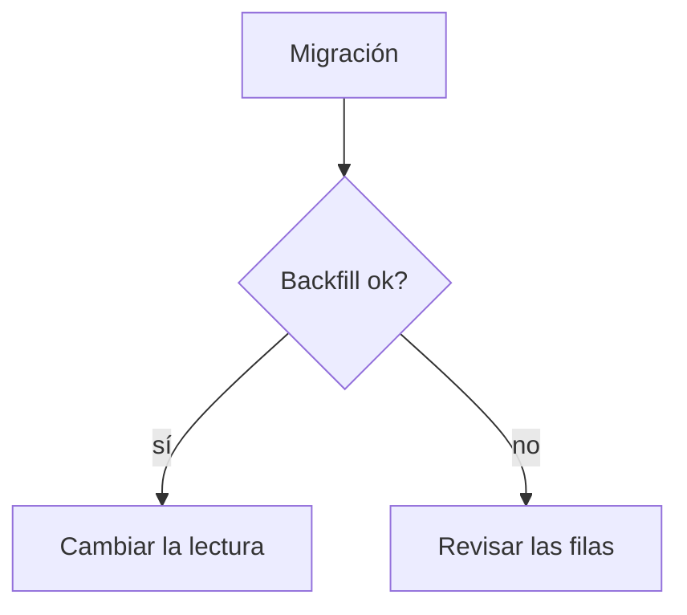

# Keeping a Ledge note as a progress feed

Ledge is a macOS notes app. Its notes are plain `.md` files in a folder, and the
`ledge` command writes to them. The app is watching that folder, so anything you
write shows up on the user's screen within about 150 ms — a dot appears on the
note's tab, and stays until they look at it.

This is a way to keep someone posted without interrupting them. Use it when a
task is long enough that they would otherwise have to ask.

## Check it is there

```bash
ledge folder          # prints where the notes live
```

If the command is not found, the user has not installed Ledge, or not put it on
the PATH — say so and carry on without it. Do not fall back to writing `.md`
files into the notes folder yourself: the app writes through file coordination
and a plain write can land in the middle of one of its saves.

## At the start of a task

```bash
ID=$(ledge new "Migrate the billing service" --feed claude-code)
```

`--feed` is what marks the note as written-to by something other than the user;
it is what puts the indicator on the tab. Use a name that says what is writing —
`claude-code` is a good default. Keep the id: every other command takes it.

There is also `--strip NAME`, which puts the note on one of the extra edges of
the screen the user may have set up. Only pass it if they named one: a strip
that does not exist is not an error, the note simply lands on the main deck.

Then lay out the plan as tasks:

```bash
ledge task add "$ID" run the schema migration
ledge task add "$ID" switch the read path
ledge task add "$ID" backfill and verify
```

## As you go

Mark a task in progress when you actually start it, and tick it when it is
actually finished:

```bash
ledge task start "$ID" schema migration     # [/] — a half tick appears on it
ledge task check "$ID" schema migration     # [x]
```

`start` is what makes the note answer "what is it doing right now" rather than
only "what is left". Normally one task is in progress at a time; nothing stops
you marking several, but a note with five things underway tells the user nothing.

Matching is on the words, not on a position, so quote enough of the task to be
unambiguous. It ignores case and accents. Ticking something already ticked is
not an error — it prints `already done:` and changes nothing.

Append what the user would want to know, and nothing else:

```bash
ledge append "$ID" -- "Backfill ran in 4m12s. 3 rows failed validation, all from
the 2019 import — listed in /tmp/failed.csv."
```

Long or multi-line text can go on stdin instead:

```bash
some-command | ledge append "$ID"
```

## When the answer is a shape, draw it

A ```` ```mermaid ```` block in a note is **drawn as a diagram** on the paper,
under the fence that defines it. So when what you have to say is a process, an
order of events, a decision, or which piece talks to which, put it in one
instead of describing it in a paragraph. That is the whole reason to reach for
this: a shape is read at a glance, and a glance is all this note gets.

The backticks and the newlines make this a job for stdin:

````bash
ledge append "$ID" <<'EOF'

EOF
````

The source stays in the note and stays editable — the drawing goes underneath
it — so this is still a plain `.md` file that renders on GitHub too.

### What is drawn

Checked against the renderer, not assumed:

| | |
|---|---|
| `graph TD` / `graph LR` / `flowchart` | steps, decisions, anything with arrows |
| `sequenceDiagram` | who called what, in order |
| `stateDiagram-v2` | what something can be, and how it moves |
| `classDiagram`, `erDiagram` | shapes of data |
| `pie` | a split worth seeing |
| `journey`, `architecture-beta` | occasionally |

`gantt`, `mindmap` and `timeline` are **not** drawn. Nothing breaks — the note
says, in a quiet line, that it could not draw that block — but you have spent
the user's attention on a fence they now have to read as text.

### Keep it small

This is a sticky note, not a whiteboard. Five to eight nodes says something at a
glance; twenty says "open me later", which is the opposite of the point. If the
shape genuinely needs more than that, the honest move is two diagrams at two
moments in the task, not one big one.

And draw when the shape *is* the news — the plan at the start, a flow that
turned out to be different from what anyone expected. A diagram on every append
is decoration, and the rule below about not writing a transcript applies to
pictures too.

## When what you are reporting happened at a time

A ```` ```log ```` block is a line of prose with the time in front of it, drawn
in a column of its own. For an agent this is the right shape for anything with
an order to it — what you tried, what it did, when it started working — and it
beats a paragraph because it can be skimmed.

````bash
ledge append "$ID" <<'EOF'
```log
14:02 arranqué la migración
14:09 3 filas fallaron la validación
14:11 reintenté con el backfill acotado
```
EOF
````

Write `HH:MM` yourself, zero-padded — the app only fills it in for a person
pressing Enter. A line without a time is fine and lines up under the words.
Repeating the same minute is fine too: the note draws the stamp once and the
file keeps both.

Use it for a sequence. A single event is an ordinary append.

## When the answer is a form, draw that

A block of JSON with a JSONForms `uiSchema` in it is **drawn as the form it
describes** — groups as boxes, `HorizontalLayout` as columns, each `Control` as
a labelled field carrying its type and its description, an `enum` as something
you pick from, a `boolean` as a checkbox. Useful when the task is about a
schema: a dependency in an IDP, a catalogue entry, anything with a
`properties` + `uiSchema` pair.

You do not need a special fence. A plain ```` ```json ```` block is drawn if a
`uiSchema` is found anywhere inside it, which means a payload pasted or piped
straight out of an API is drawn with nothing rewritten:

````bash
{ echo '```json'; curl -s "$IDP/dependencies/rds-aurora"; echo '```'; } \
  | ledge append "$ID"
````

Three shapes all work: the whole payload with the form buried at
`attributes.schema`, an object with `uiSchema` and `properties` side by side,
and a bare uiSchema with no properties at all — which is what trying a layout
out looks like before the fields exist. Without properties the labels come from
the last segment of each `scope`.

### What it is worth saying

Two things are marked with a ⚠ in the note's own ink, and they are the reason
to draw the form rather than describe it:

- a `scope` that resolves to no property, drawn with the scope itself inside
  the field — that string is what has to change
- under the form: a property defined and never placed by any control, and an
  `additionalProperties` sitting *inside* `properties`, where JSON Schema reads
  it as a field and the rule it was meant to be is simply absent

If you are proposing a uiSchema, append it and say what the drawing shows. If
you are reading one the user already has, the warnings are worth repeating in
words — they are easy to miss in 300 lines of JSON.

### What it is not

A wireframe. Nothing takes the caret, nothing validates, and `rule` /
`condition` are not evaluated. Do not tell the user their form "works" because
it drew.

A form too tall for the note is not drawn on the paper: its block carries a
mark that opens it in a window that zooms. That is normal and not a failure —
but it does mean a 300-line payload is something they have to open, so say
what matters about it in words rather than relying on the drawing.

## Reading it back

```bash
ledge list --feed claude-code      # notes on this feed, with [done/total]
ledge get "$ID"                    # the note's text
ledge get "$ID" --json             # id, title, tasks, state
```

`ledge get --json` is the reliable way to see which tasks exist and what state
each is in — `todo`, `doing` or `done` — before deciding what to change.

## When the task is finished

Leave the note. Do not archive it and do not delete it — the user decides what
happens to their own notes. If it is genuinely finished and they asked for it to
be filed away:

```bash
ledge set "$ID" --archive
```

## What not to do

- **Do not write every step.** The point is a note they can glance at, not a
  transcript. A tick when something completes, and an append when something
  surprising happens, is the right rate. If you find yourself appending more
  than a handful of times, you are writing a log, not a feed.
- **Do not rewrite the note.** There is no command to replace the body, on
  purpose: the user may be typing in it at the same time.
- **Do not invent a note.** If `ledge` says no note matches, ask which one
  rather than creating a second one with a similar name.
