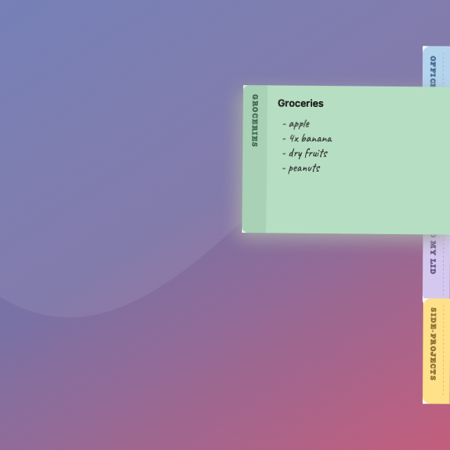
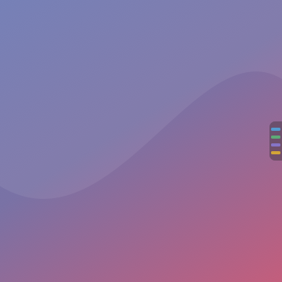
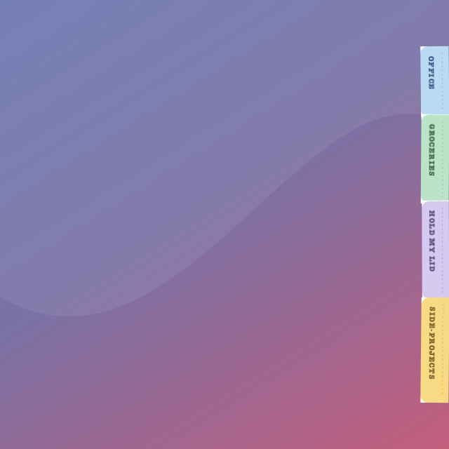
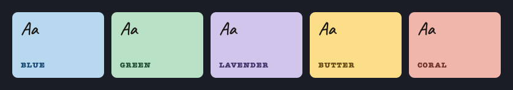

# Ledge

[](https://github.com/lbeltramino/ledge/actions/workflows/ci.yml)
[](https://github.com/lbeltramino/ledge/releases/latest)
[](LICENSE)

A native macOS notes app. Your notes live docked at the edge of the screen —
at rest a thin coloured stripe, and when you reach over, they fan out.

<p align="center">
  
</p>

| | | |
|:--:|:--:|:--:|
|  |  |  |
| **At rest** — a stripe, one dash per note | **Reach over** — the deck fans, each tab as long as its title | **Five papers**, and the ink is a deep version of each |

<sub>Not mockups: these are the app's own views, laid out and drawn to a bitmap
by <code>Ledge --render docs</code>. Change the drawing and the pictures change
with it, which is the only way an image in a README stays true.</sub>

**Every note is a plain Markdown file.** The folder is the source of truth; the
SQLite index beside it is a cache you can delete at any moment.

---

## What it does

- **The deck.** A strip of tabs on any edge of any screen. Hover and it fans;
  hover a tab and that note grows out of it at full size. Nothing takes focus
  until you deliberately click into a note to write — the app you were typing in
  stays exactly where it was.
- **Several strips.** One on a laptop, or four on a 49-inch display: left edge,
  right edge, and either side of the Dock. Drag a note from one to another.
- **Strips that follow you.** Tell a strip to show with an app and it comes out
  when that app does, and folds away when it goes. Xcode in front, the work
  notes are there. No permission needed — Ledge already watches the frontmost
  app to give focus back when you close a note.
- **Pull a note off.** Drag it away and it floats on the desk until you push it
  back to an edge.
- **Live Markdown.** Headings, lists, bold, links, inline code and fenced blocks
  are highlighted as you type — no preview pane, because a sticky note is too
  small to have two modes.
- **Everything in one list.** `⌥⌘A` searches titles, bodies and tags across every
  note, archived ones included.
- **Tags you just type.** `#work` in the body is a tag; `# Heading` is a heading.
  Searchable, clickable, and gone the moment you delete the hashtag.
- **Checklists.** `- [ ]` is a task. Click the box to tick it, and a finished one
  steps back so what is left to do is what stands out. Enter continues the list.
- **Links between notes.** `[[Another note]]` — ⌘-click follows it, and if no
  such note exists yet, following it makes one.
- **Capture what you copied.** `⌥⌘V` turns the clipboard into a note.
- **Reachable from anything.** `ledge://new?title=…&text=…`, `ledge://open?title=…`
  and `ledge://search?q=…`, so a Shortcut or a script can put things here.
- **Export.** Markdown, plain text, a single file, or a `.ledge` archive that
  imports back with colours, states, tags and dates intact.
- **Your folder, wherever you want it.** Move it into iCloud Drive and it syncs;
  every read and write has been coordinated from the first commit for exactly
  that. When two machines disagree, both notes survive and the loser is labelled.

## Download

**[Latest release →](https://github.com/lbeltramino/ledge/releases/latest)**

Unpack the zip and move `Ledge.app` to `/Applications`.

The build is **not notarised** — the signing and notarisation steps exist and are
waiting on a Developer ID — so macOS blocks it the first time and asks you to
vouch for it. Either way works:

**From System Settings.** Double-click Ledge, let it be refused, then open
**System Settings → Privacy & Security**, scroll to *Security*, and click
**Open Anyway** next to "Ledge was blocked". It stays allowed after that.
(Right-click → Open no longer works as a bypass; Apple removed it in Sequoia.)

**From the terminal**, if you prefer one line:

```sh
xattr -dr com.apple.quarantine /Applications/Ledge.app
```

Either one says the same thing: you vouch for this app. Do that only for
software you are willing to vouch for — the zip has a SHA-256 beside it if you
want to confirm the download first.

> Builds before **v0.2.1** were reported as *"damaged and can't be opened"*, and
> nothing in the interface could get past that — the app bundle's signature did
> not cover its own resources, so it really was invalid. Fixed in v0.2.1; if you
> saw that message, download again.

Ledge has no Dock icon. It appears as a coloured stripe on the right edge of your
screen and as a small glyph in the menu bar. Notes land in `~/Documents/Ledge`.

Every push to `main` also uploads a build as a workflow artifact, if you would
rather have the tip than a tagged release.

## Requirements

macOS 15 or later, and a Swift 6 toolchain. **Xcode is not required** — the Swift
Command Line Tools are enough.

## Build and run

```sh
./Scripts/bundle.sh                       # produces build/Ledge.app
open build/Ledge.app

./Scripts/bundle.sh release               # optimised
LEDGE_VERSION=0.2.0 ./Scripts/bundle.sh   # stamps the version
```

Notes are written to `~/Documents/Ledge` by default. To point it somewhere else
while you are trying it out:

```sh
LEDGE_FOLDER=/tmp/notes ./build/Ledge.app/Contents/MacOS/Ledge
```

## When something looks wrong

```sh
/Applications/Ledge.app/Contents/MacOS/Ledge --diagnose
```

Prints what the app can actually see on that machine — the appearance in force,
which font resolved and whether it has glyphs, the text view's frame and text
container, which TextKit it is on, the colour applied to the text against the
colour of the paper, and how many pixels of ink a rendered note contains. It
exists because two plausible diagnoses of an invisible-text report made from a
different Mac were both wrong.

## Tests

```sh
swift run ledge-tests                               # 85 unit tests
./build/Ledge.app/Contents/MacOS/Ledge --selftest   # 380 geometry checks
```

Both run in CI on every push. The self-test writes to a scratch folder of its
own and never touches your notes; on a machine with no display it says so and
skips the geometry checks rather than failing.

Note it is `swift run`, not `swift test`. The Command Line Tools ship
`Testing.framework` without its `_Testing_Foundation` module, and XCTest needs
full Xcode, so the suite is a plain executable target instead. `suite` / `test` /
`expect` map one-to-one onto `@Suite` / `@Test` / `#expect`, so it converts back
the day Xcode is installed.

The `--selftest` pass is the unusual one. The deck is hand-computed frames,
rotations and overlaps — the kind of thing that reads correctly in the source and
is wrong on screen. So the app drives itself through every state, at every size
it offers, on every edge, and asserts the geometry it actually produced: that
tabs are flush with the screen, that they overlap by 2–5 pt with no two gaps
alike, that no tab sits square, that a title is never clipped by the edge of its
tab, that a label reads downward (checked by rendering it to a bitmap and reading
the pixels back), and that every ink-on-paper pair clears its contrast ratio.

It has caught real bugs: a card covering the tab it belonged to, vertical jitter
fighting the tab overlap, titles sliced off by the screen edge, and a deck taller
than the display.

## How it is built

```
LedgeCore    Note model, frontmatter, ULID, fractional ranks, jitter
LedgeIndex   SQLite + FTS5 — a derived cache, deletable at any moment
LedgeStore   coordinated file I/O, FSEvents watcher, reconciliation, export
LedgeApp     AppKit shell: panels, strips, cards, editor, library
```

No package dependencies. The SQLite wrapper is ~300 lines over the system
`libsqlite3`; the ZIP container behind `.ledge` archives is written from scratch
so an archive is a real zip you can open in the Finder.

### The one thing to know before changing anything

**Markdown files are the truth. The index is a cache.**

Every mutation writes the file first and the index second. If the two ever
disagree, the folder wins — `rebuildIndex()` is always safe to call. The index
carries no migration logic on purpose: a schema mismatch deletes the file and
rebuilds it from the folder. A derived cache that needs migrating has stopped
being a cache.

What follows from that: anything that must survive lives in the frontmatter —
title, colour, state, tags, dates, deck order, and which strip the note sits on.
Anything merely convenient lives in the index — a note's window size, for
instance. Losing the second on a rebuild costs nothing but a default.

### A note file

```markdown
---
id: 01K2F3QW8N4Z7YB0PMRTXAGH5J
title: Office
color: blue
state: active
rank: a0V
tags: [work]
strip: left-1
created: 2026-08-29T21:06:12Z
updated: 2026-08-29T21:31:44Z
---
- understand all the apis listed
```

`id` is a ULID and never changes, so retitling renames the file without the app
losing the note. `rank` is a fractional index, so dragging one note in the deck
rewrites exactly one file instead of every file below it. Keys written by other
tools are preserved verbatim.

## Design decisions worth knowing

- **The panel paints 12 pt but is 24 pt wide.** The extra is transparent, and a
  tracking area over it catches the pointer before it reaches the screen edge.
  The obvious alternative — a global mouse monitor — demands Accessibility
  permission for the same result, and a premium app should not open with a scary
  dialog.
- **Global shortcuts go through Carbon `RegisterEventHotKey`**, not
  `NSEvent.addGlobalMonitorForEvents`, for the same reason.
- **The deck is a non-activating `NSPanel`.** Hovering, fanning and previewing
  never touch focus. Only a click into a note activates Ledge — and dismissing it
  puts focus back where it came from.
- **Nothing sits square.** Every note has a rotation, offset, tab overlap and
  paper tint derived from a hash of its id, so it leans the same way forever
  rather than re-rolling on each redraw. A card straightens under the caret:
  crooked to read, level to write.
- **`LSUIElement`, but with a main menu.** Nobody sees it; it exists because the
  main menu is where ⌘C, ⌘V and ⌘Z are *defined*.

`SPEC.md` has the full specification: motion tokens, geometry, palette,
typography, and the build order the project followed.

## Making the icon

```sh
./Scripts/icon.sh
```

The icon is drawn by the app, from the same palette as the deck, at every size
macOS asks for. It cannot drift away from the thing it stands for.

## Where the notes live

`~/Documents/Ledge` by default, one Markdown file per note, with a hidden
`.index.sqlite3` beside them that you can delete at any time.

**Choose notes folder…** in the menu bar item points Ledge somewhere else, and
offers to bring the notes with it. Put it in iCloud Drive and it syncs — every
read and write is coordinated through `NSFileCoordinator`, so nothing has to
change for that to work.

## Shortcuts

| | |
|---|---|
| `⌥⌘N` | New note |
| `⌥⌘V` | New note from the clipboard |
| `⌥⌘F` | Search every note |
| `⌥⌘A` | All notes |
| `⌥⌘L` | The archive |
| `⌥⌘D` | Show or hide the deck |
| `⌘↩` | Open the note in the full editor |
| `⌘B` `⌘I` `⌘E` `⌘K` | Bold, italic, code, link |
| `⌘⇧T` | Turn lines into tasks, or back |
| `⌘⇧L` `⌘⇧1…3` | List, headings |

## Tags

Written in the note, like everything else about it. `#work` is a tag; `# Heading`
is a heading — the space is what tells them apart. Take the hashtag out and the
tag goes with it. A tag you write by hand into the frontmatter is never removed,
because Ledge did not put it there.

## Sync conflicts

Put the folder in iCloud Drive and two machines will eventually disagree. Ledge
notices by **frontmatter id**, not by filename, so it holds whatever iCloud
decides to call the copy. Both files are always kept: the one edited later keeps
the note's identity, and the other becomes an ordinary note titled
`(conflicted copy)` and tagged `conflict`. Nothing is merged for you and nothing
is thrown away.

## Updates

Ledge asks GitHub's public API once a day whether there is a newer release, and
if there is, says so in the menu. It does not install anything — a self-updater
that replaced an unsigned binary the user had to talk Gatekeeper into would be
worse than no updater. Switch it off under **Check for updates**.

## Not in v1

No rich text, attachments or images. No reminders. No plugin API. No merge UI for
a sync conflict — you get both notes and decide. `SPEC.md` §13 tracks what is
written down against what is built.

## Releasing

Tag it and the workflow does the rest — builds, tests, packages, and publishes a
release with the zip and its checksum attached:

```sh
./Scripts/release.sh v0.2.5 "what changed"
```

It waits for the run belonging to *that tag* and then checks the release
actually has its assets. Reading `gh run list` straight after a push returns
whichever run finished last, which is how a release once got reported as
successful on the strength of the previous one.

It signs and notarises too, if the repository has the secrets for it
(`MACOS_CERTIFICATE`, `MACOS_CERTIFICATE_PASSWORD`, `MACOS_SIGN_IDENTITY`,
`APPLE_ID`, `APPLE_TEAM_ID`, `APPLE_APP_PASSWORD`). Without them it publishes an
unsigned build and says so in the release notes. `Ledge.entitlements` already
declares the sandbox the signed build will run in.

## Licence

MIT, see `LICENSE`. The bundled Caveat typeface is SIL OFL 1.1 — see `NOTICE.md`.
