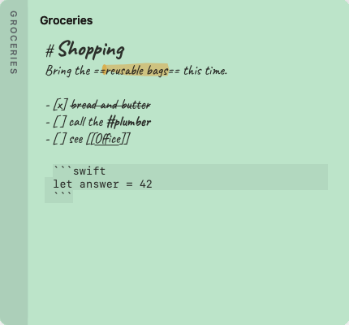

# Ledge

[](https://github.com/lbeltramino/ledge/actions/workflows/ci.yml)
[](https://github.com/lbeltramino/ledge/releases/latest)
[](LICENSE)

A native macOS notes app. Your notes live docked at the edge of the screen —
at rest a thin coloured stripe, and when you reach over, they fan out.

<p align="center">
  
</p>

| | | |
|:--:|:--:|:--:|
|  |  |  |
| **At rest** — a stripe, one dash per note | **Reach over** — the deck fans, each tab as long as its title | **Five papers**, and the ink is a deep version of each |

<sub>Not mockups: these are the app's own views, laid out and drawn to a bitmap
by <code>Ledge --render docs</code>. Change the drawing and the pictures change
with it, which is the only way an image in a README stays true.</sub>

**Every note is a plain Markdown file.** The folder is the source of truth; the
SQLite index beside it is a cache you can delete at any moment.

---

## What it does

- **The deck.** A strip of tabs on any edge of any screen. Hover and it fans;
  hover a tab and that note grows out of it at full size. Nothing takes focus
  until you deliberately click into a note to write — the app you were typing in
  stays exactly where it was.
- **A deck longer than the screen.** Tabs keep the length their titles ask for
  however many notes you have, and the stack scrolls under a window onto it —
  the tab cut off at the end is how you know there is more. Opening a note off
  the end brings its tab back into view. At rest the stripe shows a few dashes
  rather than one per note, because nobody counts two hundred.
- **Several strips.** One on a laptop, or four on a 49-inch display: left edge,
  right edge, and either side of the Dock. Drag a note from one to another.
- **Strips that follow you.** Tell a strip to show with an app and it comes out
  when that app does, and folds away when it goes. Xcode in front, the work
  notes are there. No permission needed — Ledge already watches the frontmost
  app to give focus back when you close a note.
- **Pull a note off.** Drag it away and it floats on the desk until you push it
  back to an edge.
- **Live Markdown.** Headings, lists, bold, links, inline code and fenced blocks
  are highlighted as you type — no preview pane, because a sticky note is too
  small to have two modes.
- **Everything in one list.** `⌥⌘A` searches titles, bodies and tags across every
  note, archived ones included.
- **Tags you just type.** `#work` in the body is a tag; `# Heading` is a heading.
  Searchable, clickable, and gone the moment you delete the hashtag.
- **Checklists.** `- [ ]` is a task. Click the box to tick it, and a finished one
  steps back so what is left to do is what stands out. Enter continues the list,
  Tab nests it, Shift-Tab takes it back out, and numbered lists renumber
  themselves. `- [/]` is one in progress: half a tick is drawn where the slash
  is, and its text stays at full strength while finished tasks recede, so on any
  note exactly one line leans forward.
- **Paste code and it stays code.** A manifest, a Terraform block, a shell
  script or a `package.json` arrives fenced, tagged with its language and
  coloured — instead of the page of headings and bullets that Markdown makes of
  `# comment` and `- name:`. The note takes its name from the snippet:
  `Deployment/api`, `aws_s3_bucket.logs`, `kubectl rollout status`. Pasting
  prose is still pasting prose.
- **A note something else keeps up to date.** `ledge`, the command that ships
  inside the app, lets a script or an agent create a note, add checklist items,
  tick them off and append what it found. A note on a feed carries a small mark
  on its tab — hollow while you are up to date, filled when there is something
  you have not seen. Nothing pops up, nothing steals focus, and you can keep
  typing in the note while it writes: a save is a merge, not an overwrite.
- **Take the code back out.** Hover a code block and a small mark appears at its
  top right; click it and the block is on your clipboard without its fences,
  ready to paste into a terminal. `⌘⇧C` does the same for the block the caret is
  in.
- **The small things.** Paste a URL over some words and they become the link
  text. Type a bracket or a quote with something selected and it wraps rather
  than replaces. `⌥↑` and `⌥↓` move the line you are on, renumbering the list
  behind you.
- **A highlighter.** `==like this==`, drawn as a marker swipe rather than a
  coloured rectangle — it overshoots, wobbles and presses harder where it
  started. Yellow, or pink on a yellow note. Select words and the pen appears
  over them: pressing it writes the `==`, so a highlight made with the mouse and
  one typed by hand are the same file. `⌘⇧H` does the same from the keyboard.
- **The headings, as somewhere to jump.** A note with two headings or more
  offers a small index beside the button that opens the editor: the outline,
  indented by level, click one and you are there. Nothing is written into the
  note — no `[TOC]`, no markers to go stale — and a `# comment` inside a code
  block is a comment, not a heading.
- **Drop things on the edge.** Drag a selection out of any app, or a text file
  out of the Finder, and let it go over the strip: the deck comes out to meet it
  and the stripe lights up. It arrives read the same way a paste is, so a
  dropped manifest is fenced and named rather than turned into headings and
  bullets.
- **Find in a note.** `⌘F`, then `⌘G` to step through. Matches are struck in the
  same marker, in a pen that is neither the highlighter nor the paper, with the
  one you are on pressed harder.
- **Links between notes.** `[[Another note]]` — ⌘-click follows it, and if no
  such note exists yet, following it makes one.
- **Capture what you copied.** `⌥⌘V` turns the clipboard into a note.
- **Reachable from anything.** `ledge://new?title=…&text=…`, `ledge://open?title=…`
  and `ledge://search?q=…`, so a Shortcut or a script can put things here.
- **Archived, never deleted.** Putting a note away keeps its colour, its dates
  and its tags, and it stays searchable — `⌥⌘L` is the archive, and anything in
  it comes back the way it left. Deleting is a separate, deliberate act with a
  confirmation.
- **Make it yours.** Five papers. Two hands to write in — a casual one that
  looks handwritten, or New York if you want to read rather than admire. Tab
  size, note size and overall zoom are separate settings, because a 13-inch
  laptop and a 49-inch display do not want the same deck. Pin a strip and its
  tabs stay out instead of folding away. Drag a note bigger and it stays that
  size, just that note.
- **Everything is in the menu bar.** The icon is where the notes folder is
  chosen, the sizes are set, floating notes are called back, and every window is
  reachable — there is no Dock icon and no preferences window to hunt for.
- **No Accessibility access.** The global shortcuts work from inside any app
  without it, because they are registered as real hotkeys rather than by
  watching everything you type — the permission most launchers ask for, and the
  one that lets an app read every keystroke you make. macOS will ask once for
  access to your Documents folder, the way it does for any app that keeps files
  there, and that is the only prompt you will see.
- **Export.** Markdown, plain text, a single file, or a `.ledge` archive that
  imports back with colours, states, tags and dates intact.
- **Your folder, wherever you want it.** Move it into iCloud Drive and it syncs;
  every read and write has been coordinated from the first commit for exactly
  that. When two machines disagree, both notes survive and the loser is labelled.

## Install

Three ways, in order of how much they ask of you.

**Build it yourself** — no security prompt at all, because nothing was
downloaded. Needs the Swift Command Line Tools, not Xcode:

```sh
git clone https://github.com/lbeltramino/ledge && cd ledge
./Scripts/bundle.sh && cp -r build/Ledge.app /Applications/
```

**Homebrew** — more steps than it looks like it should be, but `brew upgrade
--cask ledge` afterwards, which matters when every manual update would otherwise
mean vouching for the app again:

```sh
brew tap lbeltramino/ledge https://github.com/lbeltramino/ledge
brew trust lbeltramino/ledge
brew install --cask ledge
xattr -dr com.apple.quarantine /Applications/Ledge.app
```

Homebrew quarantines what it downloads and offers no supported way around it, so
the last line is unavoidable and is the one that matters: it is you vouching for
an app Apple has not checked. Nothing here does it for you.

**[Download the zip](https://github.com/lbeltramino/ledge/releases/latest)** —
unpack, move `Ledge.app` to `/Applications`, then let macOS refuse it once and
allow it in **System Settings → Privacy & Security → Open Anyway**. (Right-click
→ Open is not a bypass any more; Apple removed it in Sequoia.) Or:

```sh
xattr -dr com.apple.quarantine /Applications/Ledge.app
```

> **Why any of this?** The build is signed, but only ad-hoc — there is no Apple
> Developer ID behind it, so macOS cannot check who made it. Every path above
> ends with you saying you trust it anyway. The zip ships with a SHA-256 if you
> want to confirm what you got, and the whole thing builds from source in a few
> seconds if you would rather not take anyone's word for it.
>
> Builds before **v0.2.1** were reported as *"damaged and can't be opened"* and
> no amount of allowing helped — that one was a real defect in the bundle's
> signature, fixed since. If you saw that, download again.

Ledge has no Dock icon. It appears as a coloured stripe on the edge of your
screen and as a small glyph in the menu bar. Notes land in `~/Documents/Ledge`.

Every push to `main` also uploads a build as a workflow artifact, if you would
rather have the tip than a tagged release.

## Requirements

macOS 15 or later on **Apple Silicon**. The published build is arm64 only, so it
will not launch on an Intel Mac even though macOS 15 runs on some of them —
build from source there, or ask and it can ship as a universal binary.

To build: a Swift 6 toolchain. **Xcode is not required** — the Swift Command
Line Tools are enough.

The download is 1.3 MB. Unpacked it is 3.4 MB: a 2.1 MB app, the 776 KB `ledge`
command beside it, a 396 KB handwriting font and a 212 KB icon. There are no
third-party frameworks and nothing is embedded — no runtime, no browser.

## Build and run

```sh
./Scripts/bundle.sh                       # produces build/Ledge.app
open build/Ledge.app

./Scripts/bundle.sh release               # optimised
LEDGE_VERSION=0.2.0 ./Scripts/bundle.sh   # stamps the version
```

Notes are written to `~/Documents/Ledge` by default. To point it somewhere else
while you are trying it out:

```sh
LEDGE_FOLDER=/tmp/notes ./build/Ledge.app/Contents/MacOS/Ledge
```

## What it costs

Measured on an idle Mac with five notes, by `--diagnose` and by macOS itself:

| | |
|---|---|
| Memory | **13 MB** — the `phys_footprint` Activity Monitor shows |
| CPU, idle | **0.0%** across ten one-second samples |
| Threads | 3 |
| Highlighting | **under 0.1 ms** per keystroke, at 20 lines or at 1000 |

Resident size reads around 68 MB, and almost all of that is shared AppKit pages
every Mac app maps. The number that costs you something is the footprint.

It was 12 MB when this table was first written and is 13.4 MB now, measured from
outside the process with `vmmap --summary` after eighteen idle seconds. For
comparison, on the machine that number came from: Notes 103 MB, Chrome 281 MB,
Safari 496 MB.

`--diagnose` will tell you about 16 MB, and that is not the same measurement:
it prints the footprint *after* compiling every highlighting rule, resolving
fonts, building text views and rendering notes to bitmaps, because those are the
things it exists to check. The idle number is the one in the table.

Nothing polls. The deck sleeps until the pointer reaches the edge, the folder is
watched by FSEvents rather than scanned, notes are written 250 ms after you stop
typing, and the update check is one request a day that you can switch off.

The highlighting figure took a fix to earn: the highlighter re-styled the whole
note on every keystroke, which was 26 ms a key at a thousand lines — a stutter
you can feel. It now restyles only the lines that changed, grown to swallow any
fenced block they sit inside, and the cost stopped depending on how long the
note is.

## When something looks wrong

```sh
/Applications/Ledge.app/Contents/MacOS/Ledge --diagnose
```

Prints what the app can actually see on that machine — the appearance in force,
which font resolved and whether it has glyphs, the text view's frame and text
container, which TextKit it is on, the colour applied to the text against the
colour of the paper, and how many pixels of ink a rendered note contains. It
exists because two plausible diagnoses of an invisible-text report made from a
different Mac were both wrong.

## Tests

```sh
swift run ledge-tests                               # 187 unit tests
./build/Ledge.app/Contents/MacOS/Ledge --selftest   # the geometry, on this screen
```

Both run in CI on every push. The self-test writes to a scratch folder of its
own and never touches your notes; on a machine with no display it says so and
skips the geometry checks rather than failing.

Note it is `swift run`, not `swift test`. The Command Line Tools ship
`Testing.framework` without its `_Testing_Foundation` module, and XCTest needs
full Xcode, so the suite is a plain executable target instead. `suite` / `test` /
`expect` map one-to-one onto `@Suite` / `@Test` / `#expect`, so it converts back
the day Xcode is installed.

The `--selftest` pass is the unusual one. The deck is hand-computed frames,
rotations and overlaps — the kind of thing that reads correctly in the source and
is wrong on screen. So the app drives itself through every state, at every size
it offers, on every edge, and asserts the geometry it actually produced: that
tabs are flush with the screen, that they overlap by 2–5 pt with no two gaps
alike, that no tab sits square, that a title is never clipped by the edge of its
tab, that a label reads downward (checked by rendering it to a bitmap and reading
the pixels back), and that every ink-on-paper pair clears its contrast ratio.

It has caught real bugs: a card covering the tab it belonged to, vertical jitter
fighting the tab overlap, titles sliced off by the screen edge, and a deck taller
than the display.

## How it is built

```
LedgeCore    Note model, frontmatter, ULID, fractional ranks, jitter
LedgeIndex   SQLite + FTS5 — a derived cache, deletable at any moment
LedgeStore   coordinated file I/O, FSEvents watcher, reconciliation, export
LedgeApp     AppKit shell: panels, strips, cards, editor, library
```

No package dependencies. The SQLite wrapper is ~300 lines over the system
`libsqlite3`; the ZIP container behind `.ledge` archives is written from scratch
so an archive is a real zip you can open in the Finder.

### The one thing to know before changing anything

**Markdown files are the truth. The index is a cache.**

Every mutation writes the file first and the index second. If the two ever
disagree, the folder wins — `rebuildIndex()` is always safe to call. The index
carries no migration logic on purpose: a schema mismatch deletes the file and
rebuilds it from the folder. A derived cache that needs migrating has stopped
being a cache.

What follows from that: anything that must survive lives in the frontmatter —
title, colour, state, tags, dates, deck order, and which strip the note sits on.
Anything merely convenient lives in the index — a note's window size, for
instance. Losing the second on a rebuild costs nothing but a default.

### A note file

```markdown
---
id: 01K2F3QW8N4Z7YB0PMRTXAGH5J
title: Office
color: blue
state: active
rank: a0V
tags: [work]
strip: left-1
created: 2026-08-29T21:06:12Z
updated: 2026-08-29T21:31:44Z
---
- understand all the apis listed
```

`id` is a ULID and never changes, so retitling renames the file without the app
losing the note. `rank` is a fractional index, so dragging one note in the deck
rewrites exactly one file instead of every file below it. Keys written by other
tools are preserved verbatim.

## Design decisions worth knowing

- **The panel paints 12 pt but is 24 pt wide.** The extra is transparent, and a
  tracking area over it catches the pointer before it reaches the screen edge.
  The obvious alternative — a global mouse monitor — demands Accessibility
  permission for the same result, and a premium app should not open with a scary
  dialog.
- **Global shortcuts go through Carbon `RegisterEventHotKey`**, not
  `NSEvent.addGlobalMonitorForEvents`, for the same reason.
- **The deck is a non-activating `NSPanel`.** Hovering, fanning and previewing
  never touch focus. Only a click into a note activates Ledge — and dismissing it
  puts focus back where it came from.
- **Nothing sits square.** Every note has a rotation, offset, tab overlap and
  paper tint derived from a hash of its id, so it leans the same way forever
  rather than re-rolling on each redraw. A card straightens under the caret:
  crooked to read, level to write.
- **`LSUIElement`, but with a main menu.** Nobody sees it; it exists because the
  main menu is where ⌘C, ⌘V and ⌘Z are *defined*.

`SPEC.md` has the full specification: motion tokens, geometry, palette,
typography, and the build order the project followed.

## Making the icon

```sh
./Scripts/icon.sh
```

The icon is drawn by the app, from the same palette as the deck, at every size
macOS asks for. It cannot drift away from the thing it stands for.

## Where the notes live

`~/Documents/Ledge` by default, one Markdown file per note, with a hidden
`.index.sqlite3` beside them that you can delete at any time.

**Choose notes folder…** in the menu bar item points Ledge somewhere else, and
offers to bring the notes with it. Put it in iCloud Drive and it syncs — every
read and write is coordinated through `NSFileCoordinator`, so nothing has to
change for that to work.

<p align="center">
  
</p>

## Shortcuts

| | |
|---|---|
| `⌥⌘N` | New note |
| `⌥⌘V` | New note from the clipboard |
| `⌥⌘F` | Search every note |
| `⌥⌘A` | All notes |
| `⌥⌘L` | The archive |
| `⌥⌘D` | Show or hide the deck |
| `⌘↩` | Open the note in the full editor |
| `⌘B` `⌘I` `⌘E` `⌘K` | Bold, italic, code, link |
| `⌘⇧T` | Turn lines into tasks, or back |
| `⌘⇧H` | Highlight the selection |
| `⌘⇧C` | Copy the code block the caret is in |
| `⌘F` | Find in this note |
| `⌘G` `⇧⌘G` | Next match, previous match |
| `⇥` `⇧⇥` | Nest a list item, or take it back out |
| `⌥↑` `⌥↓` | Move the line, or the selected lines |
| `⌥⇧↓` | Duplicate them |
| `⌘+` `⌘-` `⌘0` | Bigger, smaller, back to normal |
| `⌘S` | Save now — it saves itself anyway |
| `⌘W` | Put the note away |
| `⌘N` | New note |
| `⌘1`…`⌘9` | Open the nth note on the deck |
| `⌘,` | Settings |
| `⌘⇧L` `⌘⇧1…3` | List, headings |
| `⌘⇧.` | Quote the selected lines |
| ⌥-click a `[ ]` | Mark that task in progress, or take it back out |

## Markdown it understands

Headings, bold, italic, quotes, bullets, numbered lists, tasks, tags, links
between notes, and links out. For code, all three of Markdown's forms: inline
`` ` ``, fenced ``` ``` ``` and `~~~`, and four-space indented blocks — which is
what you get from pasting a terminal. A nested list item also starts with four
spaces and is deliberately not treated as code.

## Notes something else writes

Ledge notes are files in a folder, and the app watches that folder, so anything
that writes a `.md` file there shows up within 150 ms. `ledge` is the supported
way to do that — it writes through the same file coordination the app uses, so
it cannot land in the middle of one of its saves.

```bash
ID=$(ledge new "Migrate billing" --feed claude-code)
ledge task add "$ID" run the schema migration
ledge task start "$ID" schema migration      # [/] — in progress
ledge task check "$ID" schema migration      # [x] — done
ledge append "$ID" -- "Backfill ran in 4m12s, 3 rows failed validation."
ledge list --feed claude-code          # → 01J…  Migrate billing  [1/3]  ← claude-code
```

A task in progress is written `- [/]`, which is Obsidian's convention and looks
like half a tick — which is what Ledge draws over it: the first stroke of a
tick, in the note's accent, with the text at full strength while finished tasks
recede. A viewer that does not know `[/]` shows it as plain text rather than as
a box, so an unknown marker can never read as *done*. ⌥-click a box to set it by
hand; a plain click still finishes a task from any state.

Every command is a *local* edit — it appends, or it changes one line. There is
deliberately no way to replace a note's body: you may be typing in it at the
same time, and with a 250 ms autosave you are typing more often than it looks.
Tasks are matched by their words rather than by position, ignoring case and
accents, because an agent that remembers "item 3" ticks the wrong thing the
moment you add one.

`--feed NAME` is what marks the note as written-to by something else. That is
what puts the dot on the tab. Whether you have seen the changes is kept per
machine, in preferences rather than in the file: written to the note it would
show the same dot on your other Mac, and clearing it would be a write, which
would wake the watcher, which would refresh, which would clear it again.

Everything the command does:

| | |
|---|---|
| `ledge new <title>` | `--feed NAME` `--strip NAME` `--color C` `--body TEXT`; prints the id |
| `ledge append <note> <text…>` | a block at the end |
| `ledge task add <note> <text…>` | an unticked task, beside the others |
| `ledge task start <note> <text…>` | mark it in progress — `[/]` |
| `ledge task check <note> <text…>` | tick it |
| `ledge task uncheck <note> <text…>` | untick it |
| `ledge set <note>` | `--title` `--color` `--feed` `--archive` `--activate` |
| `ledge get <note> [--json]` | the text, or id/title/tasks/state |
| `ledge list [--feed NAME] [--json]` | with `[done/total]` and what is writing |
| `ledge folder` | where the notes live |

`<note>` is an id, or enough of a title to be unambiguous — an ambiguous name is
refused rather than guessed at. Text may also arrive on stdin. `--folder PATH`
or `$LEDGE_FOLDER` picks the folder; otherwise it uses the one the app is using,
which it reads from the app's own preferences.

You can keep typing in a note while this writes to it. See **Sync conflicts**
for what happens when you both touch the same line.

`skills/ledge/SKILL.md` in this repo is a Claude Code skill that teaches an
agent the above. Copy it to `~/.claude/skills/` to have it available everywhere.

If you installed with Homebrew, `ledge` is already on your PATH. Otherwise it is
at `/Applications/Ledge.app/Contents/MacOS/ledge-cli`.

## Code

Fenced blocks are recognised and coloured in **HCL/Terraform, YAML, JSON,
JavaScript, TypeScript, Python, Go, Bash, Dockerfile, SQL, TOML, Makefile,
Groovy/Jenkinsfile and XML**. The language is detected from what you pasted —
you do not have to tag the fence — and the note is named after the snippet.

Hovering a block shows a copy mark at its top right — the block without its
fences, on the clipboard, in one click. That is usually the whole reason the
snippet is in a note.

The colouring uses the note's own two colours rather than a syntax theme:
structure in ink, values in the accent, comments faded back. Eleven paper
colours and a theme of its own would be a fight.

Inside a block, spell checking is off — nothing in a shell command is a
spelling mistake — and so are quote substitution, dash substitution, text
replacement and autocorrect, everywhere. A command that has been silently
rewritten is a bug you find in production.

`ledge --diagnose` prints which forms are recognised by running them, rather
than by consulting a list that can go stale.

## Tags

Written in the note, like everything else about it. `#work` is a tag; `# Heading`
is a heading — the space is what tells them apart. Take the hashtag out and the
tag goes with it. A tag you write by hand into the frontmatter is never removed,
because Ledge did not put it there.

## Sync conflicts

Put the folder in iCloud Drive and two machines will eventually disagree. Ledge
notices by **frontmatter id**, not by filename, so it holds whatever iCloud
decides to call the copy. Both files are always kept: the one edited later keeps
the note's identity, and the other becomes an ordinary note titled
`(conflicted copy)` and tagged `conflict`. Two machines' copies are never merged
for you, and nothing is thrown away.

Two writers on **one** machine are a different matter and are merged, because
that case has an answer: you typing in a note while `ledge` writes to the same
file. A save is a three-way merge between the text as the file last held it,
the text on screen, and the text on disk now — see `Merge` in `LedgeCore`. Edits
that touch different lines both land; edits to the same line keep both versions,
since a note can carry the duplication until you tidy it and conflict markers in
a sticky note cannot.

## Updates

Ledge asks GitHub's public API once a day whether there is a newer release, and
if there is, says so in the menu. It does not install anything — a self-updater
that replaced an unsigned binary the user had to talk Gatekeeper into would be
worse than no updater. Switch it off under **Check for updates**.

## Not in v1

No rich text, attachments or images. No reminders. No plugin API. No merge UI for
a sync conflict — you get both notes and decide. `SPEC.md` §13 tracks what is
written down against what is built.

## Releasing

Tag it and the workflow does the rest — builds, tests, packages, and publishes a
release with the zip and its checksum attached:

```sh
./Scripts/release.sh v0.2.5 "what changed"
```

It waits for the run belonging to *that tag* and then checks the release
actually has its assets. Reading `gh run list` straight after a push returns
whichever run finished last, which is how a release once got reported as
successful on the strength of the previous one.

It signs and notarises too, if the repository has the secrets for it
(`MACOS_CERTIFICATE`, `MACOS_CERTIFICATE_PASSWORD`, `MACOS_SIGN_IDENTITY`,
`APPLE_ID`, `APPLE_TEAM_ID`, `APPLE_APP_PASSWORD`). Without them it publishes an
unsigned build and says so in the release notes. `Ledge.entitlements` already
declares the sandbox the signed build will run in.

## Licence

MIT, see `LICENSE`. The bundled Caveat typeface is SIL OFL 1.1 — see `NOTICE.md`.
